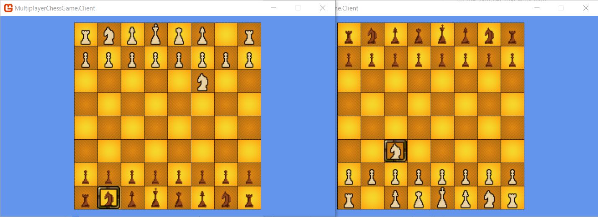

# Multiplayer Chess Game

A Multiplayer Chess Game.

## Screenshot



## How to Run

1. Start the first shell to run the server:

    ```
    dotnet restore
    cd src/MultiplayerChessGame.Server
    dotnet run
    ```

1. Start the second shell to run one client:

    ```
    cd src/MultiplayerChessGame.Client
    dotnet run
    ```

1. Start the third shell to run the other client:

    ```
    cd src/MultiplayerChessGame.Client
    dotnet run
    ```

## How to Play

- Change chess piece
    - `q`, `w`, `e`, `r`, `t`, `y`, `a`, `s`, `d`, `f`, `g`, `h`
- Move selection
    - arrow keys
- Move chess
    - `z` to select source position
    - `x` to select destination
- Change side
    - `0`
- Undo
    - back
