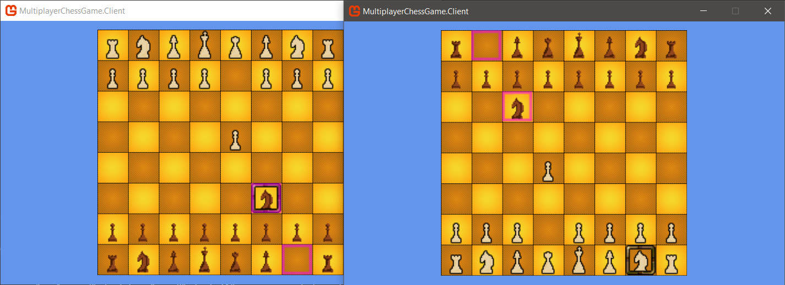

# Multiplayer Chess Game

A Multiplayer Chess Game.

## Screenshot



## How to Run

1. Start the first shell to run the server:

    ```
    dotnet restore
    cd src/MultiplayerChessGame.Server
    dotnet run
    ```

1. Start the second shell to run one client:

    ```
    cd src/MultiplayerChessGame.Client
    dotnet run
    ```

1. Start the third shell to run the other client:

    ```
    cd src/MultiplayerChessGame.Client
    dotnet run
    ```

## How to Play

- Change chess piece
    - `q`, `w`, `e`, `r`, `t`, `y`, `a`, `s`, `d`, `f`, `g`, `h`
- Move selection
    - arrow keys
- Move chess
    - `z` to select source position
    - `x` to select destination
- Change side
    - `0`
- Undo
    - backspace
- Redo
    - `+` (the key that has a lower case `=`)

## How to build

- Client

    1. Run the following script:

        ```sh
        cd src/MultiplayerChessGame.Client
        dotnet publish -r win-x64 -p:PublishSingleFile=true --self-contained true
        cp appsettings.json bin/Debug/netcoreapp3.1/win-x64/publish
        cp appsettings.local.json bin/Debug/netcoreapp3.1/win-x64/publish
        ```
    
    1. The game file will be in folder `src/MultiplayerChessGame.Client/bin/Debug/netcoreapp3.1/win-x64/publish`.

- Server

    1. Modify [`packup.ps1`](packup.ps1) to match the architecture of your server machine.
    1. Run the script [`packup.ps1`](packup.ps1);
    1. Copy the zip file and [`install.sh`](install.sh) to the server;
    1. Run the script `install.sh`;
    1. The game server will be in folder `opt/chess-game-server` under your home folder.

## TODO

- [x] Add full chess rules
- [ ] Apply mutex on `SharedGameState`
- [ ] Support multi-room
